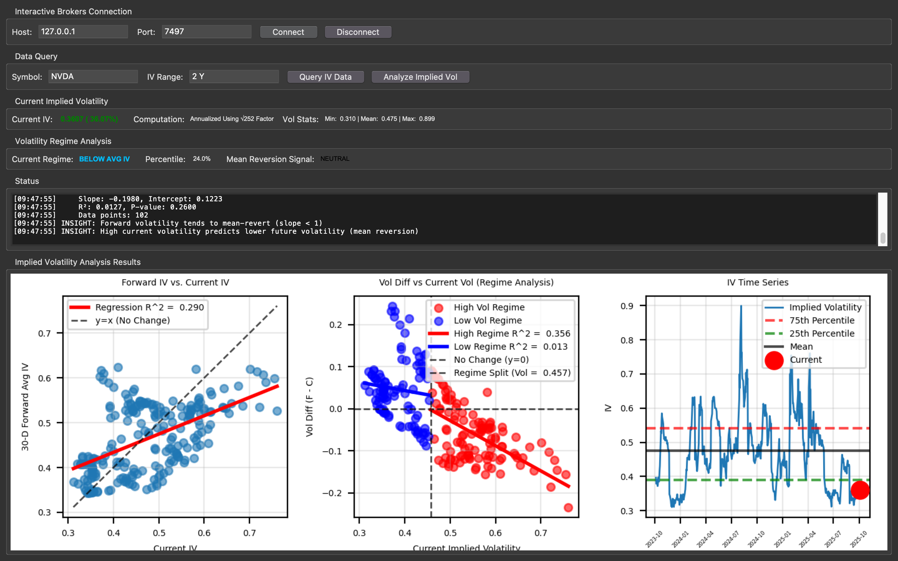

# Implied Volatility Trading Dashboard
A Tkinter-based GUI application for quickly analyzing implied volatility levels for any given equity ticker using real market data provided by Interactive Brokers (need an IB account to run this program)

## What is Implied Volatility?
Within the Black Scholes Option Pricing Model, there are 5 parameters: Strike Price, Spot Price, Days till Expiration (annualized), sigma (volatility), and risk-free rate. If given these 5 parameters, the black scholes partial differential equations will output a call or put price depending on the variation used. 

However, in the real world, if we consider the economic laws of equilibrium, in any given market, the option price (which is the final output of Black Scholes) is readily avaliable. This price the market reaches could be seen as a direct consequence of the laws of supply and demand, whereby buyers and sellers within a market will reach an equilibrium price that we can see as the market price. If the balance shifts, the price will rise and fall. Now, whether this market price is the fair price is a different question entirely, but it is a price nonetheless. 

Furthermore, other parameters like days till expiration, strike price, spot price, and the risk-free rate (10Y Bond Yield) are also readily avaliable. The only parameter that is not is the volatility of the underlying asset, sigma. 

Instead of trying to guess the values of sigma, we instead inversely use the Black Scholes PDE, using all known values to then find the volatility that is implied by the current market price. For example, say that NVDA has an earnings event coming up and the market expects its earnings to increase. As a result, we see the prices in the market for call options increasing. This is because demand for NVDA call options has increased due to further expectations. This means that future volatility is already priced into the market price and so when we use this market price to extract the implied volatility for the future, we are essentially getting a sense of what the market expects in terms of volatility going forward. This can also paint a picture for the expected magnitude of price movement (without directional bias) along with market fear or uncertainty. 

Some caveats include that we don't know how far forward and the fact that the market could be wrong about the volatility. If NVDA's earnings come out and they are actually much lower than what the market had expected, since the market hadn't priced this in, the price will see a massive drop which occurs because the market is trying to adjust to the new information and find the equilibrium price again. 

Overall, Implied Volatility is a very important metric using in option derivatives trading as it gives a picture of the future volatility the market expects to occur which can be used to make trading decisions or even base entire strategies on. 

## Why Analyze Implied Volatility?
1. Mean Reversion Property: IV has strong mean-reverting characteristics; when it reaches extreme levels, it tends to revert to its long-term average, creating trading opportunities.
2. Regime Dependency: IV behaves differently in high vs. low volatility regimes, requiring regime-specific analysis for optimal trading strategies.
3. Predictive Power: Current IV levels contain information about future volatility changes, which can be exploited through various options strategies.
4. Risk Management: Understanding IV dyanmics for instruments within one's portfolio is very important for hedging purposes and sizing vega trades. 

## Key Features: 
- Direct Connection to IB TWS API (Note: you must have IB TWS Desktop app installed in order for the API to work, as it uses a TCP Socket where the port is specified within TWS)

- Historical Data Retrieval with Automatic Annualization (Ensure that daily is selected for volatility within TWS settings otherwise IV levels within the GUI will be inaccurate)

- Mean Reversion Signal (Not trading advice, only tips to consider)
    - When IV > 80th percentile → Consider volatility-selling strategies
    - When IV < 20th percentile → Consider volatility-buying strategies

## 3 Core Analyses

### 1. Forward IV vs. Current IV (Unconditional Regression)
What it shows: Relationship between current implied volatility and the average IV over the next 30 days.

To calculate the forward IV, I did a rolling average of the current implied volatility over a 30 day period (due to daily bars) and then shifted it 30 indices back. 

Thus, for a given index, say index 0:
    - We would have current IV as the current IV implied by the market
    - We would also have the average IV over the next 30-days for comparison

The reason for this is to see whether there is any connection between IV today and IV in the future, hence the regression. Does low IV today imply higher IV moving forward? Does high IV today imply lower IV moving forward. If IV does tend to be mean-reverting, how strong is the signal? What if in the short-term, IV doesn't mean revert? How can we measure or be aware of this? 

We know the characteristics of IV differ from instrument to instrument and thus this application is meant to faciliate the analysis of IV both historically and currently for any given instrument. 

#### Key Insights:
Slope < 1: Indicates mean reversion (high IV today → lower IV in 30 days)
Slope = 1: IV generally stays constant over 30 day window relative to today
Slope > 1: IV exhibits momentum (high IV today → even higher IV ahead)
R² value: Measures predictive power of current IV for future IV (generally tends to be low for the unconditional regression)

### 2. Vol Difference vs. Current Vol (Regime Analysis)
What it shows: How the change in IV (Forward - Current) relates to current IV levels, split into high and low volatility regimes.

We split the dataset at the intersection point between the y=x line and the regression line for the first unconditional regression. 

We take a look at a x-value, or the current IV, of this intersection point and anything greater than this intersection current IV (to the right) will be classified as high volatility regime data points and anything to the left of the current IV x-intersection point will be classified as low volatility regime. It is important to note that high and low volatility regimes are not referring to the regression line in the first graph but the x-value which is current IV.

We also take the vol difference between the current and forward looking IVs because it makes it much easier to see relationships. 
    - If vol difference is negative, this means forward 30 day avg IV is lower than current IV 
    - If vol difference is positive, this means forward 30 day avg IV is higher than current IV

#### Key Insights:
- Negative slope in high regime: High IV predicts decreasing IV (strong mean reversion)
- Positive slope in low regime: Low IV predicts increasing IV (mean reversion from below)
- Different slopes: Confirms regime-dependent behavior
- y=0 line: Represents no change (Current IV = Forward IV)

### 3. Implied Volatility Time Series 
What it shows: Historical IV evolution overtime with percentile bands

## Practical Use Cases
1. Option Selling Strategies
    - If time series IV above the 75th percentile band
    - If high vol regime (2nd graph) has strong negative slope (R^2 > 0.5) 
    - If current vol regime is "HIGH IV" 
    - Might be a good time to go short vega(ofc this is not a trading model but that is one use case)
2. Option Buying Strategies
    - If time series IV below 25th percentile band
    - If low vol regime (2nd graph) has strong positive slope (R^2 > 0.5)
    - If current vol regime is "LOW IV"
    - Might be good time for long vega positions 

## Setup
1. Need uv package manager installed (pip install uv in GLOBAL environment not a venv)
2. uv run main.py runs the app (no need for any other setup)

